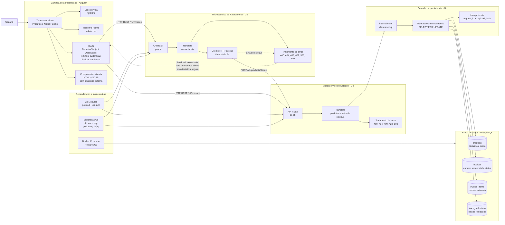

# Sistema de Emissao de Notas Fiscais

Projeto tecnico desenvolvido para atender ao desafio de criacao de uma aplicacao Angular com backend em Go, organizada em microsservicos e com persistencia real em banco de dados.

A solucao permite cadastrar produtos, criar notas fiscais com multiplos itens, imprimir notas abertas, fechar a nota apos a impressao e atualizar automaticamente o saldo dos produtos utilizados.

## Solucao Desenvolvida

O sistema foi dividido em tres partes principais:

- Frontend Angular: interface para cadastro de produtos, cadastro/listagem de notas fiscais, impressao e exclusao de notas abertas.
- Microsservico de Estoque: responsavel pelo cadastro de produtos, consulta de saldos e baixa de estoque.
- Microsservico de Faturamento: responsavel pela criacao, consulta, exclusao e impressao de notas fiscais.

A persistencia e feita em PostgreSQL. Os dois microsservicos acessam o banco por meio de uma camada interna de armazenamento, com transacoes para proteger as operacoes criticas.

## Funcionalidades

### Cadastro de Produtos

Permite cadastrar produtos com:

- Codigo unico.
- Descricao.
- Saldo disponivel em estoque.

O servico de estoque valida os campos obrigatorios, impede saldo negativo e retorna conflito quando ja existe produto com o mesmo codigo.

### Cadastro de Notas Fiscais

Permite criar notas fiscais contendo um ou mais produtos, cada um com sua quantidade.

Ao criar uma nota, o sistema:

- Define o status inicial como `Open`.
- Gera uma numeracao sequencial.
- Valida se os produtos existem.
- Verifica disponibilidade de estoque considerando reservas de outras notas abertas.

### Impressao de Notas Fiscais

A impressao so e permitida para notas com status `Open`.

Ao imprimir uma nota fiscal, o servico de faturamento:

1. Busca a nota fiscal e seus itens.
2. Valida se a nota ainda esta aberta.
3. Solicita ao servico de estoque a baixa dos produtos.
4. Fecha a nota alterando o status para `Closed`.
5. Retorna a nota atualizada para a interface.

Caso o servico de estoque esteja indisponivel, a nota permanece aberta e a operacao pode ser tentada novamente com seguranca.

## Arquitetura

A aplicacao segue uma arquitetura em camadas com microsservicos. O frontend conversa com os servicos por HTTP REST. O servico de faturamento tambem se comunica internamente com o servico de estoque durante o fluxo de impressao da nota.



## Camadas do Projeto

### Camada de Apresentacao

Localizada em `web/`, foi desenvolvida com Angular. Ela contem as telas, formularios, estados de carregamento, mensagens de sucesso/erro e chamadas para os microsservicos.

Principais responsabilidades:

- Exibir produtos e notas fiscais.
- Validar formularios no cliente.
- Consumir as APIs REST.
- Mostrar feedback ao usuario em caso de sucesso ou falha.
- Atualizar a tela de produtos apos a impressao de uma nota.

### Camada de API

Localizada em `cmd/stock-service` e `cmd/invoicing-service`.

Cada microsservico possui:

- Arquivo `main.go` para inicializacao.
- Configuracao de servidor HTTP.
- Rotas REST versionadas em `/v1`.
- Handlers para processar requisicoes.
- Tratamento padronizado de erros.

### Camada de Negocio

As regras de negocio ficam principalmente nos handlers e na camada `internal/store`.

Exemplos:

- Apenas notas abertas podem ser impressas.
- Notas fechadas nao podem ser excluidas.
- Produtos devem ter saldo suficiente.
- A criacao da nota considera estoque reservado por outras notas abertas.
- A baixa de estoque e idempotente.

### Camada de Comunicacao entre Servicos

O servico de faturamento possui um cliente HTTP interno para chamar o servico de estoque.

Essa comunicacao e usada no fluxo de impressao da nota fiscal. O cliente possui timeout de 5 segundos e traduz falhas de comunicacao para respostas apropriadas ao usuario.

### Camada de Persistencia

Localizada em `internal/store`, usa `database/sql` com PostgreSQL.

Essa camada encapsula o acesso as tabelas:

- `products`
- `invoices`
- `invoice_items`
- `stock_deductions`

Operacoes sensiveis usam transacoes e bloqueios pessimistas com `SELECT ... FOR UPDATE`, reduzindo riscos em cenarios concorrentes.

### Banco de Dados

O banco utilizado e PostgreSQL, executado via Docker Compose.

As migrations ficam em `cmd/migrate/migrations` e criam as estruturas necessarias para produtos, notas fiscais, itens de nota, baixas de estoque e indices.

## Detalhamento Tecnico Requerido

### Ciclos de vida do Angular utilizados

Foi utilizado o ciclo de vida `OnInit`.

Nos componentes de produtos e notas fiscais, o metodo `ngOnInit()` inicializa os formularios reativos e carrega os dados necessarios para a tela.

Tambem foi utilizado `DestroyRef` com `takeUntilDestroyed`, recurso moderno do Angular para encerrar automaticamente inscricoes RxJS quando o componente e destruido.

### Uso de RxJS

Sim, o projeto utiliza RxJS.

O RxJS foi usado para:

- Representar chamadas HTTP como `Observable`.
- Manter estado reativo com `BehaviorSubject`.
- Transformar respostas da API com `map`.
- Atualizar estados locais com `tap`.
- Tratar erros com `catchError` e `throwError`.
- Controlar carregamentos com `finalize`.
- Executar chamadas paralelas com `forkJoin`.
- Encadear a impressao da nota com a atualizacao do estoque usando `switchMap`.

O projeto tambem usa `toSignal` para integrar observables com Angular Signals.

### Outras bibliotecas utilizadas

No frontend:

- `@angular/forms`: formularios reativos e validacoes.
- `@angular/router`: navegacao entre telas.
- `@angular/common`: recursos comuns do Angular.
- `rxjs`: fluxos assincronos e estado reativo.
- `vitest` e `jsdom`: testes no frontend.
- `prettier`: formatacao de codigo.

No backend:

- `go-chi/chi`: roteamento HTTP.
- `go-chi/cors`: configuracao de CORS.
- `go.uber.org/zap`: logs estruturados.
- `joho/godotenv`: carregamento de variaveis de ambiente.
- `lib/pq`: driver PostgreSQL.
- `database/sql`: acesso ao banco de dados.
- `go-sqlmock`: apoio a testes com banco mockado.

### Componentes visuais

Nao foi utilizada uma biblioteca visual externa, como Angular Material, Bootstrap ou PrimeNG.

Os componentes visuais foram implementados com HTML, SCSS e recursos nativos do Angular, mantendo a aplicacao leve e com controle direto sobre layout, formularios, tabelas, botoes, mensagens e indicadores de carregamento.

### Gerenciamento de dependencias no Golang

O gerenciamento de dependencias foi feito com Go Modules.

O arquivo `go.mod` declara o modulo e as dependencias utilizadas. O arquivo `go.sum` registra os checksums das versoes instaladas, garantindo reprodutibilidade e integridade.

### Frameworks utilizados no Golang

O backend foi desenvolvido em Go com uma abordagem leve.

O principal framework/biblioteca de apoio e o `go-chi/chi`, usado para roteamento HTTP e organizacao das rotas REST.

Tambem foram usados middlewares para:

- Timeout de requisicoes.
- Logs HTTP.
- Recuperacao de panicos.
- CORS.

A camada de dados utiliza `database/sql` diretamente, sem ORM.

### Tratamento de erros e excecoes no backend

O backend possui tratamento padronizado de erros em cada microsservico.

As respostas HTTP sao mapeadas conforme o tipo de falha:

- `400 Bad Request`: dados invalidos.
- `404 Not Found`: recurso nao encontrado.
- `409 Conflict`: conflito de negocio, como estoque insuficiente ou produto duplicado.
- `422 Unprocessable Entity`: dados validos sintaticamente, mas impossiveis de processar.
- `503 Service Unavailable`: falha de comunicacao com outro microsservico.
- `500 Internal Server Error`: erro inesperado.

Os erros internos sao registrados em logs estruturados com Zap, mas mensagens sensiveis nao sao expostas ao usuario.

Tambem existe middleware de recuperacao de panico, evitando que uma falha inesperada derrube o servidor ou exponha detalhes internos.

No caso de falha do servico de estoque durante a impressao, o faturamento retorna erro apropriado, mantem a nota aberta e permite nova tentativa posterior.

## Requisitos Atendidos

- Arquitetura com dois microsservicos: estoque e faturamento.
- Frontend Angular consumindo APIs REST.
- Banco de dados PostgreSQL real.
- Cadastro de produtos.
- Cadastro de notas fiscais com multiplos itens.
- Numeracao sequencial de notas fiscais.
- Status de nota fiscal aberta ou fechada.
- Impressao de nota fiscal com indicador de processamento na interface.
- Bloqueio de impressao para notas nao abertas.
- Baixa automatica de estoque ao imprimir.
- Tratamento de falha entre microsservicos.
- Tratamento de concorrencia em operacoes de estoque.
- Idempotencia na baixa de estoque.

## Estrutura do Projeto

```text
.
|-- cmd
|   |-- invoicing-service
|   |-- migrate
|   `-- stock-service
|-- internal
|   |-- db
|   |-- env
|   `-- store
|-- web
|   |-- src
|   `-- package.json
|-- docker-compose.yml
|-- Dockerfile
|-- go.mod
|-- go.sum
`-- Makefile
```

## Execucao Local

Subir o banco de dados:

```bash
make db/up
```

Executar migrations:

```bash
make migrate-up
```

Executar o servico de estoque:

```bash
go run ./cmd/stock-service
```

Executar o servico de faturamento:

```bash
go run ./cmd/invoicing-service
```

Executar o frontend:

```bash
cd web
npm install
npm start
```

Por padrao, a aplicacao Angular roda em `http://localhost:4200`.
